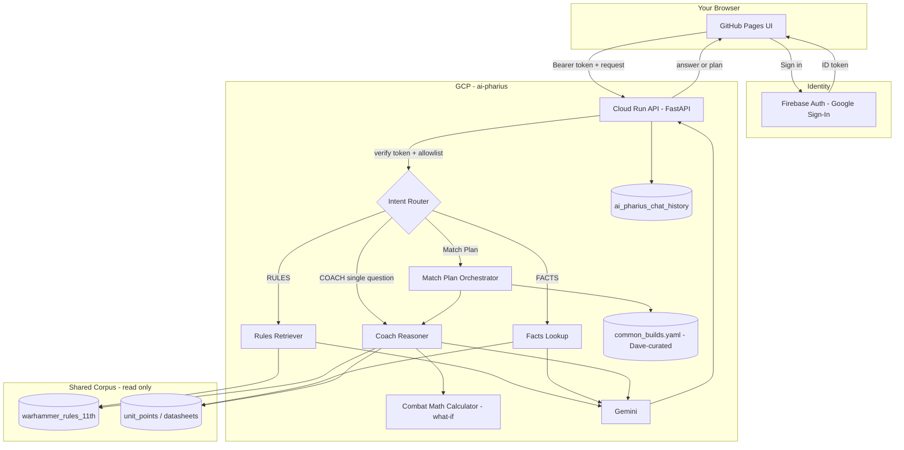
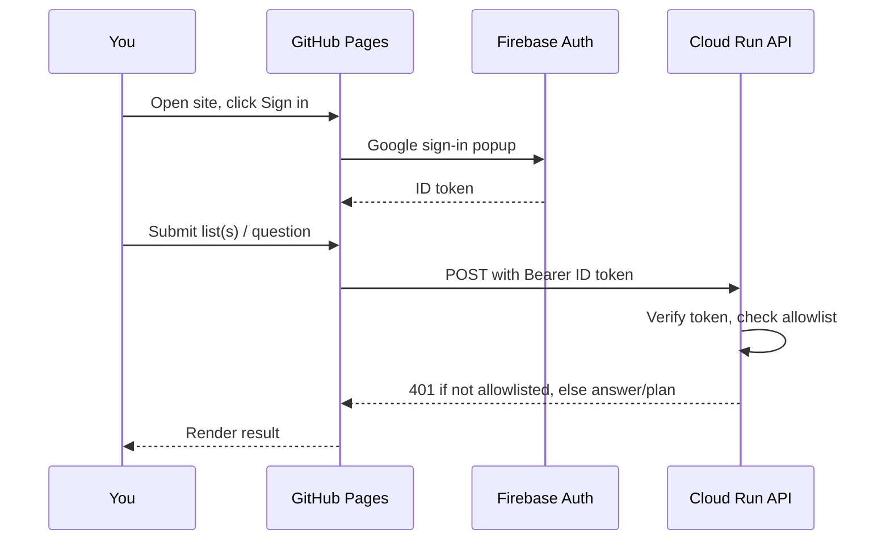
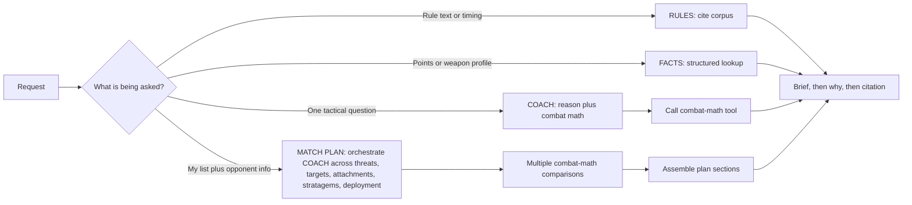

# ai-pharius - Design

> Reason from real rules and real profiles to build you a match plan - never a memorized matchup.

This is the canonical **why** doc. Phased delivery lives in [plan_of_travel.md](plan_of_travel.md).

---

## Mission

**ai-pharius** is a personal 11th-edition match-planning coach. Give it your list and what you know about the opponent, and it reasons - from unit profiles, rules mechanics, and dice probability - to a concrete plan: threats to expect, targets to prioritize, characters to attach, stratagems to budget, and how to deploy.

You bring everything it needs up front so it can think hard once and hand you a plan you can take to the table.

Every tactical conclusion must be **derivable**: read off toughness/saves/invulnerability/wounds/keywords/ability text, apply the actual attack-resolution rules, and run the real probability math. Nothing is a memorized "X beats Y" - if the Hydra can't show the reasoning chain, it shouldn't give the answer.

---

## Primary use case: Match Plan

**Input:** your full list, plus whatever you know about the opponent - see input tiers below - plus optionally mission/deployment type.

**Output:** a single plan covering:

1. **Threat assessment** - what can hurt you badly, and with what (derived from real weapon profiles vs. your defenses)
2. **Priority targets** - what you can efficiently remove and why (calculator-backed expected damage, unit vs. unit)
3. **Attachment / support calls** - who rides with whom and why (e.g. reasoning that a fast, tanky support character's revive-style ability is wasted on a small, fragile unit that won't survive long enough to trigger it - derived from movement, wounds, and ability text, not memorized)
4. **Stratagem / CP budget** - what's worth holding, what's worth spending early, specific to this matchup
5. **Deployment / screening guidance** - what needs protecting, what needs to threaten first
6. **Win-condition framing** - objective/secondary alignment given both lists

### Input tiers (you rarely have a full list)

| Tier | What you know | What the plan can promise |
|------|----------------|----------------------------|
| 1 - Full list | Opponent's exact units | Plan built directly against real units |
| 2 - Faction + detachment | Detachment rules/stratagems are knowable from the rules corpus; units are not | Precise on playstyle and stratagem timing; unit-specific parts are flagged as assumptions |
| 3 - Faction only | Broad faction tendencies only | Generic strengths/weaknesses; heavy assumption-flagging |

For tiers 2 and 3, the plan must **state its assumptions explicitly** (e.g. "assuming a typical Invasive Swarm build brings Hormagaunts and a Screamer-Killer or two - common, not confirmed") and say what changes if the assumption is wrong. Never present a guessed unit list as a confirmed fact.

### Where "likely units" come from

Not official rules text, not a fixed fact, and it goes stale as the meta shifts - handled separately from the shared rules corpus:

- **v1: Dave-curated notes** (`data/common_builds.yaml` in this repo) - short, hand-maintained per faction/detachment, updated occasionally. Not a pipeline - a file Dave edits. Coaching product knowledge, so it lives here; rules/facts stay consumer-only from the shared corpus.
- **Later, if worth it:** automated scraping of tournament list sites would be a real ingestion pipeline - if we ever want that, it belongs in roboto-guilliman as another published collection. Not planned for v1.

---

## Secondary mode: COACH (standalone tactical questions)

For one-off reasoning questions that don't need a full plan - e.g. "best character to attach to 5 Rubric Marines?" or "what should I target-priority between a Screamer-Killer and a Hormagaunt blob?"

Same reasoning discipline as Match Plan, just narrower scope. Match Plan is effectively COACH run across every facet of a matchup and assembled into one document.

## Supporting modes

- **RULES** - cite rule text from the shared vector corpus
- **FACTS** - points / weapon profile lookups from structured stores

---

## Non-goals

| Non-goal | Why |
|----------|-----|
| Memorized tactical answers (attachment picks, target priority, "good vs" lists) | Must be derived from real profiles/rules/math every time, or it's not trustworthy when the meta shifts |
| Unauthenticated access | Pages shell may be public; the Cloud Run API requires Google sign-in allowlisted to Dave only |
| Second ingest / embed pipeline for rules or facts | Corpus ownership stays in roboto-guilliman; this repo reads only |
| Automated meta-list scraping | v1 uses a Dave-curated file; automated scraping (if ever) belongs in roboto-guilliman |
| Full army-list builder | Separate problem from planning around a list you already have |

---

## Reliability: golden evals verify reasoning, not memorized facts

A case like "best character to attach to 5 Rubric Marines" is scored on whether the reasoning **process** reaches a sound conclusion, not on whether an answer was retrieved from storage.

Example case `ts_rubric_5_attach`:

| Field | Content |
|-------|---------|
| Ask | Best character to attach to a unit of 5 Rubric Marines? |
| Accept | Infernal Master and/or foot Sorcerer as primary |
| Reject | Exalted Sorcerer on Disk presented as the default/best |
| Must reference | Disk's Movement/speed mismatch with a small, static unit; the ability's trigger (models destroyed / healed) being unlikely to pay off before a 5-model unit is wiped; better fit on a 10-model unit |
| Faction focus | Thousand Sons first, expand later |

Scoring is checklist-based (required claims present, forbidden claims absent), not exact-string matching.

- **Primary metric:** % of golden cases with all required claims and zero forbidden claims
- **Secondary:** citation/lookup grounding rate; calculator agreement with hand-checked math
- **Gate:** Match Plan phase exit requires a golden suite (starting with Thousand Sons cases, including the Rubric attachment case) passing human review, runnable in CI once a scorer exists

---

## Combat-math tool (design intent)

Warhammer shooting/fighting is probability arithmetic (hit %, wound %, save %, damage). LLMs are weak at that and confidently wrong, so the coach never does this arithmetic itself.

The tool must support **comparative, what-if queries**, not a single fixed calculation - e.g. "expected damage from Weapon A vs. Weapon B against this target," or "expected outcome with vs. without this stratagem applied." The LLM chooses which profiles and modifiers to compare; the tool owns all arithmetic.

Exact API shape lands in the Match Plan / COACH phase of the plan of travel - this doc locks the principle: **no vibes for dice math, and no single-shot calculator that can't compare options.**

---

## Architecture

Full annotated system map (hi-res SVG): **[architecture.html](architecture.html)**.

### Data ownership

- **Shared corpus** (rules vectors, points, datasheets): published by roboto-guilliman; ai-pharius reads only.
- **Owned here:** chat cache, allowlist config, coach/plan prompts and router, `common_builds.yaml`.

### Auth model

True "private GitHub Pages" needs GitHub Enterprise Cloud. For a personal free-tier setup:

- **GitHub Pages** stays a static shell (may be publicly reachable).
- **Firebase Auth** (Google sign-in, Spark/free) on the Pages UI.
- **Cloud Run API** verifies the Firebase ID token and checks an allowlist (Dave's UID/email only).
- Without a valid allowlisted token, requests return 401. The shell is inert without it.

ai-pharius uses its own Firebase Auth app config - standalone from other products.

---

## Mode routing

Answer shape: **brief -> why -> rules note -> caveats** for COACH; structured sections for Match Plan.

---

## Stack (planned)

| Layer | Choice |
|-------|--------|
| Frontend | GitHub Pages (`docs/`) |
| Auth | Firebase Auth (Google), allowlisted UID |
| API | FastAPI on Cloud Run (`europe-west1`), scale-to-zero |
| LLM | Gemini - cheap path for RULES/FACTS; stronger model for COACH/Match Plan |
| Rules / facts | Read-only Firestore shared corpus |
| Meta knowledge | `common_builds.yaml`, Dave-curated, owned in this repo |
| Coach cache | Own Firestore collection |
| Infra | Pulumi + GitHub Actions |
| Cost | Free-tier first |

---

## Success snapshot

Sign in, hand the Hydra your Thousand Sons list and "playing Tyranids, don't know their list," and get back a plan that correctly flags a likely Screamer-Killer/Hormagaunt mix as an assumption, gets the Rubric-attachment call right by reasoning from profiles and ability text, and backs every damage claim with calculator numbers.
